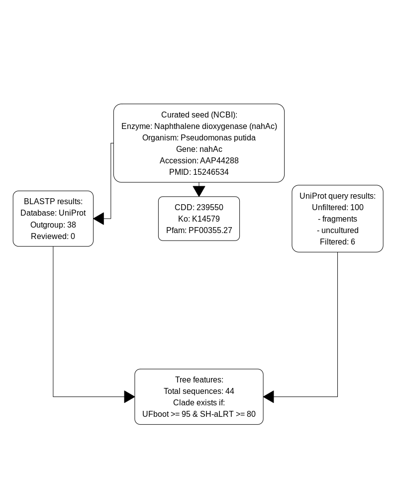
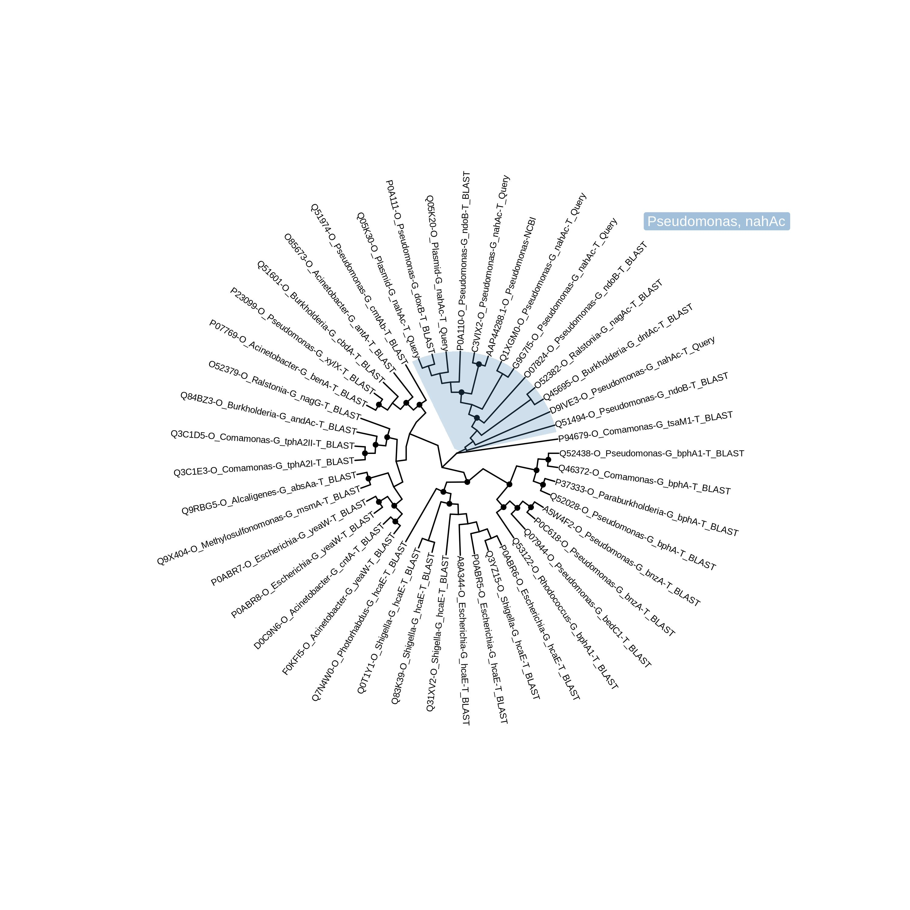

## Naphthalene dioxygenase
### Analysis pipeline

```{r pressure, echo=FALSE, out.width='100%'}


```


```{r echo=FALSE, message = FALSE}
library(readr)
library(stringr)
library(dplyr)
table_1 <- read_tsv('Naphthalene_dioxygenase_nahAc.tsv')
table_2 <- read_tsv('AAP44288.1_Pseudomonas_putida_ND6.tsv')
knitr::kable(table_2[,1:4], caption = "UniProt BLASTP")
knitr::kable(table_1[,1:4], caption="UniProt Query (Filtered)")