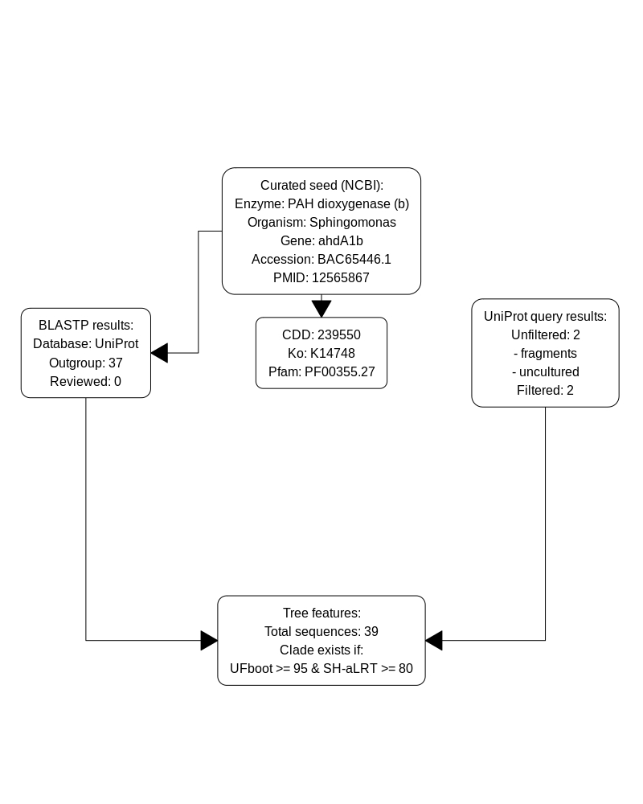
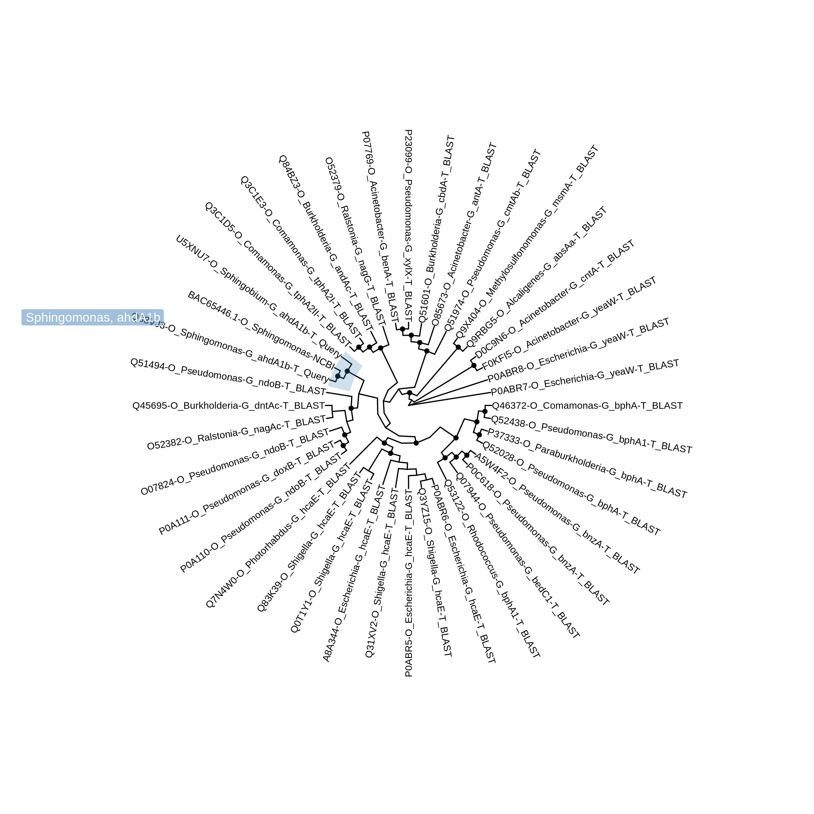

## PAH dioxygenase (b)
### Analysis pipeline

```{r pressure, echo=FALSE, out.width='100%'}


```


```{r echo=FALSE, message = FALSE}
library(readr)
library(stringr)
library(dplyr)
table_1 <- read_tsv('PAH_dioxygenase_b.tsv')
table_2 <- read_tsv('BAC65446.1_Sphingomonas_sp._P2.tsv')
knitr::kable(table_2[,1:4], caption = "UniProt BLASTP")
knitr::kable(table_1[,1:4], caption="UniProt Query (Filtered)")